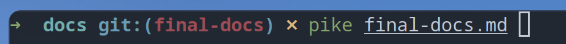

# Pike - Perfectly Incomplex Konsole Editor

### Autorzy

- Maksym Bieńkowski
- Jędrzej Grabski

## Opis Projektu

Pike jest prostym, intuicyjnym i łatwym do skonfigurowania edytorem tekstowym dla terminala, zaprojektowanym jako alternatywa dla edytorów takich
jak `nano`. Projekt ma na celu dostarczenie lekkiego narzędzia do edycji tekstu z podstawowymi funkcjami, takimi jak:

- Obsługa pracy na wielu buforach
- Wyszukiwanie w tekście.
- Obsługa cofania i powtarzania zmian.
- Konfiguracja skrótów klawiszowych.

## Statystyki kodu

Liczba testów: 78
Procent pokrycia: 82%
Spędzone godziny: wiele

Wykaz lini kodu wygenerowany przez narzędzie [cloc](https://github.com/AlDanial/cloc)

| Language | Files | Blank | Comment | Code | Total |
| -------- | ----- | ----- | ------- | ---- | ----- |
| Rust     | 9     | 553   | 291     | 2864 | 3708  |

## Napotkane Problemy

Ciężko jest teraz wymienić konkretne problemy, które spotkały nas podczas pracy, jednak częstym motywem był brak odpowiedzialnego zarządzania
pamięcią. Reguły Rust-owego kompilatora wymagają od programisty mądrego planowania struktury zależności w swoim kodzie i z tym borykaliśmy się
najczęściej. Brak dokładniejszego zaplanowania gdzie powinny znajdować się poszczególne metody i obiekty sprawił, że refaktoring dużych części kodu
był zjawiskiem raczej częstszym niż rzadszym. Wraz z biegiem projektu to problemy jednak zaczęły pojawiać się coraz rzadziej, więc uczyniliśmy pewne
postępy.

## Wnioski

Projekt ten był świetną okazją żeby zaznajomić się z językiem Rust i poznać za równo jego rozległe możliwości, jak i natknąć się na wiele przeszkód.
Zabranie się za tak duży projekt bez wcześniejszego styku z tym językiem okazało się dość dużym wyzwaniem, jednak sprawiło nam zdecydowanie
wiele frajdy.

Jesteśmy zadowoleni z efektu końcowego, jednak uważamy, że pozostało miejsce na wiele nowych funkcjonalności i ulepszeń, które planujemy w
przyszłości wprowadzić.

Wielką zaletą tego projektu jest to, że nie musi zostać odłożony na półkę po oddaniu, a ten dokument piszę w taki sposób:

